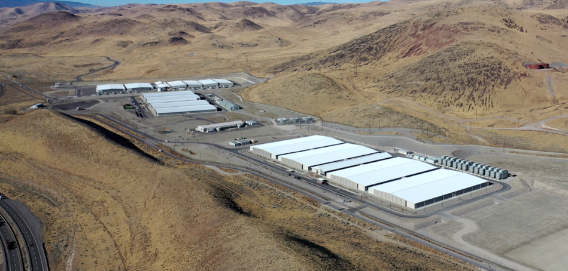
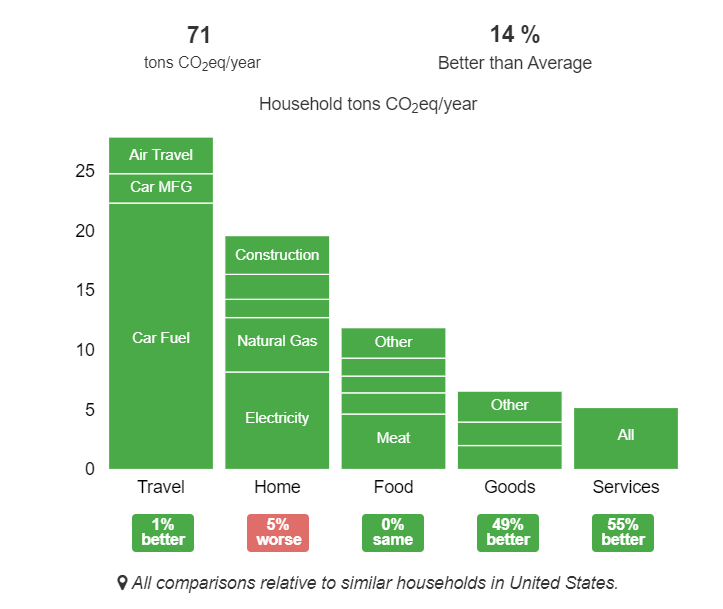
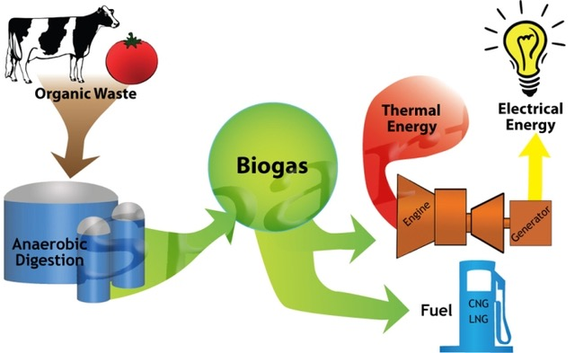

# Data Center, Sara Lam, sp20-516-239

## Data Center 2, Apple Reno NV Data Center

Apple's Reno data center was opened in 2012.  It was designed to use 80% of water for cooling than previous data centers.  It received the  U.S. Green Building Council’s LEED certification for conserving water and energy, reducing waste, and using renewable energy [@sp20-516-239-apple].  The data center is 375,000 sqft.  It uses 100% renewable energy through the Neveda Green Rider solar project.  

@fig:sp20-516-239-Reno_data_center shows Apple Reno, Nevada Data Center

{#fig:sp20-516-239-Reno_data_center}

### Reference

<https://www.apple.com/environment/pdf/Apple_Environmental_Responsibility_Report_2019.pdf>

<https://www.datacenters.com/apple-inc-reno>

<https://www.leg.state.nv.us/App/NELIS/REL/79th2017/ExhibitDocument/OpenExhibitDocument?exhibitId=26170&fileDownloadName=0215_CauPa-NV%20Energy.pdf>

## Data Center 3, My Own Carbon Footprint

@fig:sp20-516-239-carbon_footprint shows my own carbon footprint

{#fig:sp20-516-239-carbon_footprint}

### Reference

<https://coolclimate.berkeley.edu/calculator>

## Data Center 4, Other Renewable Energy - Biogas Fuel

Biogas fuel cells transform waste streams directly into electricity, with zero emissions.  

Biogas is the mixture of gases produced by the breakdown of organic matter in the absence of oxygen (anaerobically), primarily consisting of methane and carbon dioxide. Biogas can be produced from raw materials such as agricultural waste, manure, municipal waste, plant material, sewage, green waste or food waste. Biogas is a renewable energy source [@sp20-516-239-biogas].

@fig:sp20-516-239-biogas_cycle shows how biogas is generated [@sp20-516-239-biogas_fleet]:

{#fig:sp20-516-239-biogas_cycle}

Apple has data centers using biogas fuel cells, including Maiden, NC and Cupertino, CA.  

### Reference

<https://fleet.ie/biogas-a-safe-sustainable-and-economical-solution-to-decarbonise-fleets/>

<https://www.apple.com/environment/pdf/Apple_Environmental_Responsibility_Report_2019.pdf>

## Data Center 5, UPS Efforts towards Renewables

UPS, the global logistics company, aims to reduce absolute Greenhouse Gas emissions 12 percent across our global ground operations by 2025 with these 3 targets:

* Source 25% of total electricity needs from renewable sources by 2025;
* Source 40% of ground fuel from low carbon or alternative fuels by 2025; and
* Expand their  laboratory – 25% of annual vehicle purchases by 2020 will be alternative fuel and advanced technology vehicles

UPS uses an integrated pickup and delivery system to optimize network to reduce inefficiency and environmental impact.  The company uses a "rolling laboratory" of more than 10,000 vehicles to using alternative fuels, e.g. electric, electric hybrids, e-bikes, hydrogen fuel cell, hydraulic hybrid, propane, compressed natural gas (CNG), and liquefied natural gas (LNG).  

UPS reports its progress on sustainability goals.  By 2020, UPS has 25% of total vehicles purchased annually that are alternative fuel or advanced technology vehicles.  

### Reference

<https://sustainability.ups.com/sustainability-strategy/environmental-responsibility>

<https://sustainability.ups.com/progress-report/ceo-message>

<https://sustainability.ups.com/progress-report/goals-and-progress/>

## Data Center 8, Data Center Outage

Google Cloud was down on June 2, 2019.  Services were disrupted for up to 4.5 hours.  The root cause was a configuration change for a small group of servers in one region being wrongly applied to a larger number of servers across several neighboring regions.  Although Google's engineers detected the issue within seconds, but it took far longer than its target of a few minutes to remediate the problem, in part because the network congestion hampered engineers' ability to restore the correct configurations.  Impacted companies include Snapchat, Vimeo, Shopify, Discord, Pokemon GO.  Google's own services were also affected, such as YouTube, Gmail, Google Search, G Suite, Hangouts, Google Drive, Google Docs, Google Nest, and others.  Users in North America were impacted the most, some European users also experienced problems.  YouTube measured a 10% drop in global views during the incident, while Google Cloud Storage measured a 30% reduction in traffic.  Approximately 1% of active Gmail users had problems with their account.  Google Cloud Platform services were affected until mitigation completed for each region, including: Google Compute Engine, App Engine, Cloud Endpoints, Cloud Interconnect, Cloud VPN, Cloud Console, Stackdriver Metrics, Cloud Pub/Sub, Bigquery, regional Cloud Spanner instances, and Cloud Storage regional buckets. G Suite services in these regions were also affected.

### Reference

<https://www.zdnet.com/article/google-details-catastrophic-cloud-outage-events-promises-to-do-better-next-time/>

<https://www.zdnet.com/article/google-cloud-goes-down-taking-youtube-gmail-snapchat-and-others-with-it/>

<https://www.zdnet.com/article/google-heres-what-caused-sundays-big-outage/>

<https://status.cloud.google.com/incident/cloud-networking/19009>

